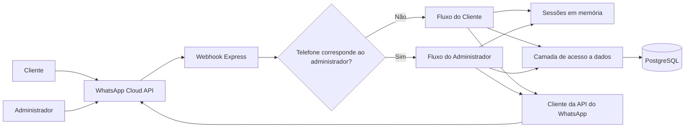
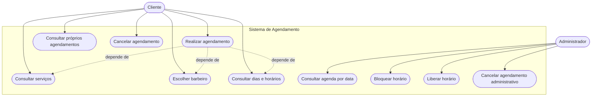
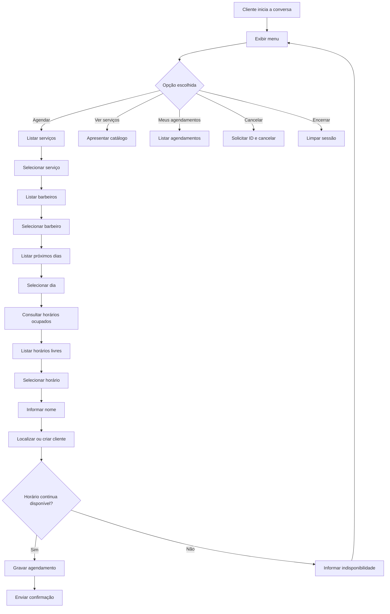
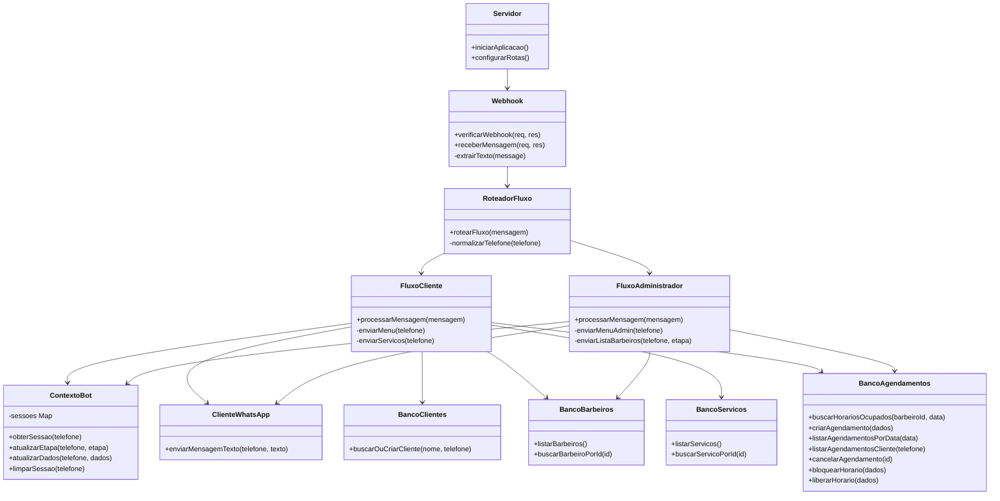
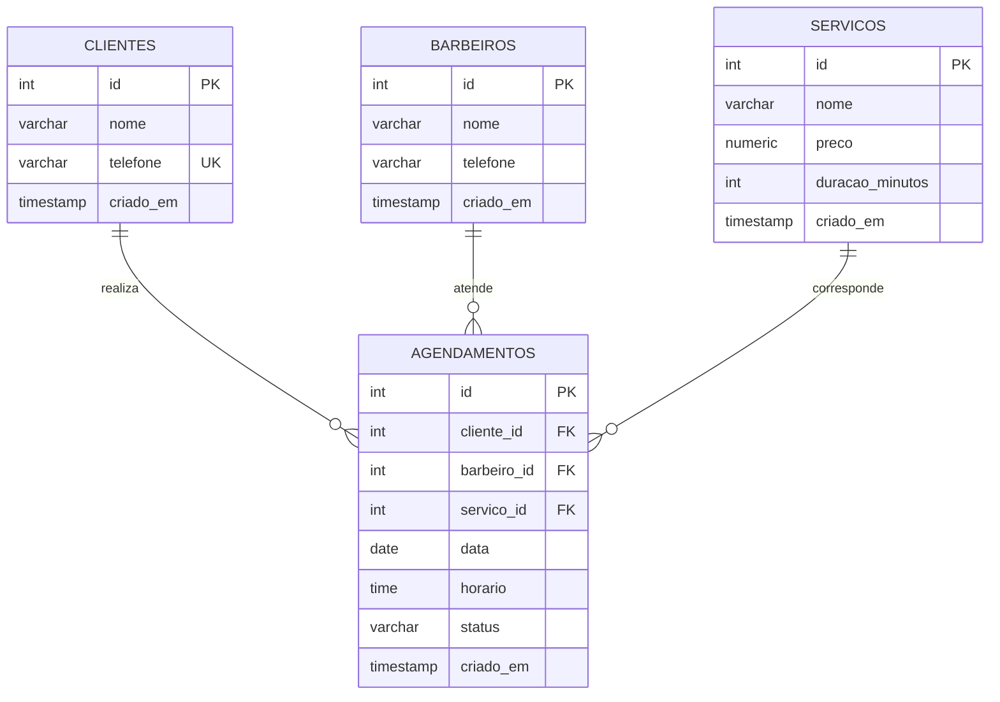
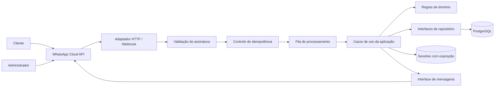
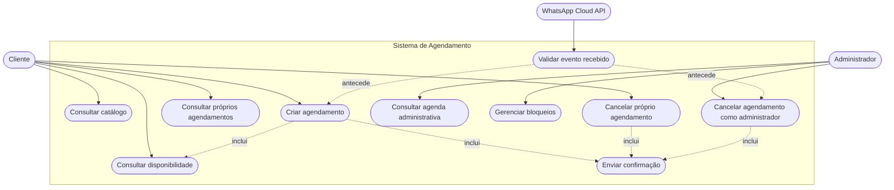
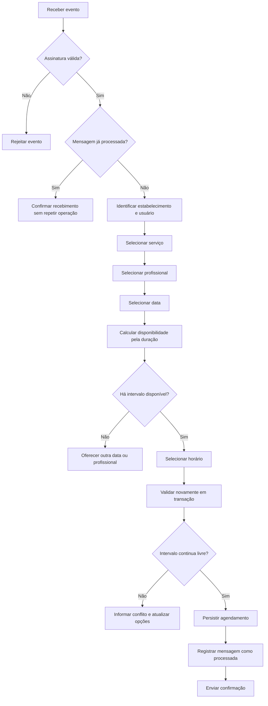
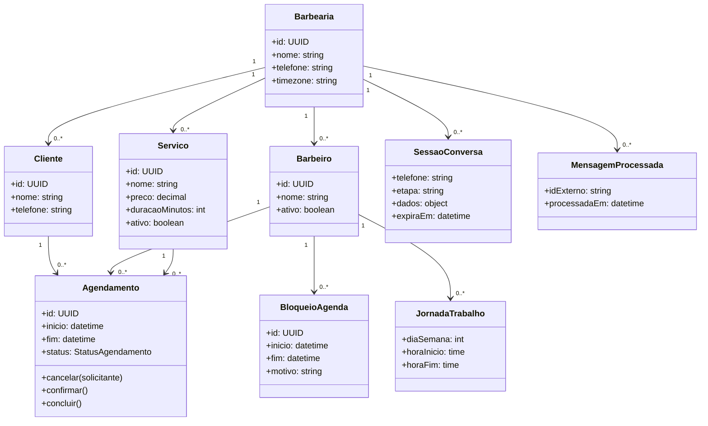
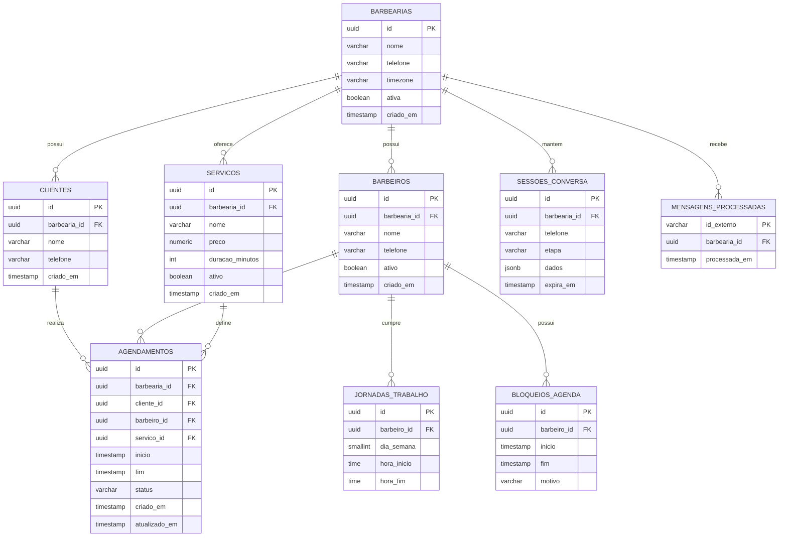

# Revisão do Projeto — Sistema de Agendamento para Barbearia via WhatsApp

## Observações da orientação

Esta revisão considera o material que está disponível no repositório do projeto **Barbearia Bot**. Na primeira parte, apresento minha leitura sobre o que já foi desenvolvido, destacando acertos e pontos que ainda precisam de atenção. Na segunda, indico um caminho possível para organizar melhor o trabalho sem abandonar a proposta que já está em andamento.

---

# Primeira etapa — Avaliação do trabalho atual

## 1. Opinião profissional sobre o trabalho hoje

O projeto apresenta uma proposta pertinente e de aplicação prática: automatizar, por meio do WhatsApp, o processo de agendamento de serviços em uma barbearia. O problema escolhido é bem delimitado, possui usuários claramente identificáveis e permite aplicar conteúdos relevantes de Engenharia de Software, como levantamento de requisitos, modelagem de processos, organização arquitetural, persistência de dados, integração entre sistemas e tratamento de regras de negócio.

No estado atual, o trabalho deve ser classificado como um **protótipo funcional ou MVP em desenvolvimento**. Já existe uma base técnica capaz de representar o fluxo principal da solução, com separação entre atendimento do cliente, atendimento administrativo, acesso ao banco de dados e comunicação com a API do WhatsApp. Essa organização demonstra uma direção adequada e torna o código relativamente simples de compreender.

Entretanto, o projeto ainda não apresenta maturidade suficiente para ser considerado um sistema pronto para produção. Há regras de autorização que precisam ser corrigidas, validações ainda superficiais, ausência de testes automatizados, armazenamento temporário das sessões apenas em memória e lacunas importantes na documentação de Engenharia de Software.

Também é necessário transformar o que já foi implementado em uma especificação acadêmica consistente. O código demonstra a ideia do sistema, mas o trabalho precisa explicar formalmente o problema, os atores, os requisitos, os casos de uso, as regras de negócio, a arquitetura adotada, o modelo de dados, as decisões técnicas e os critérios utilizados para validar a solução.

De maneira geral, a proposta é boa, o escopo é viável e a implementação possui uma base aproveitável. A recomendação é manter o tema e evoluir o projeto com foco em segurança, consistência das regras de agendamento, testes e documentação.

## 2. Pontos negativos

### 2.1 Segurança e autorização

- O cancelamento realizado pelo cliente utiliza somente o identificador do agendamento. Atualmente, não há garantia de que o agendamento informado pertence ao telefone que solicitou o cancelamento. Isso pode permitir que um cliente cancele o horário de outra pessoa.
- O recebimento de mensagens pelo webhook não valida a assinatura da requisição. A verificação existente no método `GET` serve para cadastrar o webhook, mas não autentica as notificações recebidas por `POST`.
- O administrador é identificado apenas pela comparação do telefone recebido com uma variável de ambiente. Sem validação da origem e da assinatura do webhook, essa identificação não deve ser considerada uma autenticação suficientemente segura.
- O identificador único da mensagem recebida não é utilizado para impedir o reprocessamento do mesmo evento.

### 2.2 Regras de agendamento incompletas

- A duração cadastrada para cada serviço não é considerada na montagem da agenda.
- Os horários disponíveis são fixos e espaçados de uma hora, embora existam serviços de 15, 30 e 60 minutos.
- A regra atual evita dois registros com o mesmo horário inicial, mas não trata a sobreposição entre intervalos. Por exemplo, um serviço iniciado às 14h com duração de 60 minutos deveria impedir outro início dentro desse período.
- Não existe uma representação explícita da jornada de trabalho de cada barbeiro, intervalos, folgas, feriados ou horários excepcionais.
- A consulta do cliente não restringe claramente os resultados a agendamentos futuros.
- Um cancelamento repetido pode ser apresentado como bem-sucedido, pois a atualização considera apenas o ID, sem restringir o estado anterior a `agendado`.

### 2.3 Validação de entradas

- A validação administrativa verifica apenas o formato textual da data e do horário. Valores inexistentes, como uma data fora do calendário ou um horário como `29:80`, podem ultrapassar a primeira validação.
- Não há bloqueio explícito para agendamentos ou bloqueios em datas passadas.
- O nome do cliente recebe apenas uma verificação mínima de tamanho.
- Entradas numéricas inválidas são convertidas com `Number`, mas não há uma camada central de validação e padronização dos dados.

### 2.4 Sessões e escalabilidade

- O estado da conversa é mantido em um `Map` dentro da memória do processo.
- As sessões são perdidas quando a aplicação reinicia.
- Não há prazo de expiração para conversas abandonadas.
- A solução não se comportará corretamente se houver mais de uma instância da aplicação, pois cada instância terá suas próprias sessões.
- O acúmulo de sessões não encerradas pode aumentar o consumo de memória ao longo do tempo.

### 2.5 Banco de dados

- O campo `status` aceita qualquer texto, pois não existe uma restrição que limite os valores permitidos.
- Preço e duração não possuem restrições que impeçam valores negativos ou nulos indevidos.
- As cargas iniciais de barbeiros e serviços utilizam `ON CONFLICT DO NOTHING`, mas não há restrições únicas adequadas para esses registros. A execução repetida do script pode gerar duplicidades.
- A operação de localizar e depois criar um cliente não é atômica. Requisições simultâneas do mesmo telefone podem disputar a inserção.
- O projeto utiliza um script único de criação, mas não possui controle de versões ou migrações do banco de dados.
- O modelo atual não contempla entidade de unidade/barbearia. Isso limita a evolução caso a intenção seja caracterizar o produto como SaaS para mais de um estabelecimento.

### 2.6 Integração e confiabilidade

- O processamento completo acontece antes da resposta HTTP ao webhook. Em caso de lentidão do banco ou da API externa, o provedor pode reenviar a mesma mensagem.
- Não existe fila para desacoplar o recebimento da mensagem do processamento do fluxo.
- Não há política explícita de timeout, repetição controlada ou tratamento por categoria dos erros da API externa.
- A versão da API do WhatsApp está fixada diretamente no código, dificultando manutenção futura.
- Na ausência das credenciais do WhatsApp, a aplicação simula o envio silenciosamente. Isso é útil no desenvolvimento, mas uma configuração incompleta em produção deveria interromper a inicialização ou gerar um alerta claro.

### 2.7 Qualidade e documentação

- Não existem testes unitários, testes de integração ou testes de fluxo.
- Não há ferramenta de análise estática, padronização de código ou comando de teste no projeto.
- Não existe documentação formal de requisitos funcionais e não funcionais.
- Não foram apresentados cenários de exceção, critérios de aceite ou matriz de rastreabilidade.
- O README explica a execução, mas não substitui a documentação acadêmica e técnica do sistema.
- O arquivo `.env` está versionado, apesar de constar no `.gitignore`. Mesmo vazio, ele deveria ser substituído por um `.env.example` sem credenciais reais.

## 3. Pontos positivos

- O problema tratado é real, objetivo e adequado a um projeto de Engenharia de Software.
- O escopo atual é compreensível e permite demonstrar um ciclo completo de interação entre usuário, aplicação, serviço externo e banco de dados.
- O projeto separa configuração, núcleo da aplicação, fluxos conversacionais, serviços externos e acesso aos dados.
- Os nomes de arquivos e funções, em sua maioria, comunicam corretamente suas responsabilidades.
- As consultas ao PostgreSQL utilizam parâmetros, reduzindo o risco de injeção de SQL.
- Existe uma restrição no banco para impedir dois agendamentos ativos com o mesmo barbeiro, data e horário inicial.
- O código trata a disputa básica em que duas pessoas tentam reservar simultaneamente o mesmo horário.
- O telefone é normalizado antes da comparação com o número administrativo.
- O webhook consegue interpretar mensagens de texto, respostas de botões e respostas de listas.
- Os fluxos de cliente e administrador foram separados, facilitando entendimento e manutenção.
- O projeto contempla as funções essenciais do domínio: consultar serviços, escolher profissional, agendar, consultar agenda, cancelar, bloquear e liberar horário.
- O README apresenta objetivo, tecnologias, estrutura, variáveis de ambiente e instruções básicas de execução.
- A solução é enxuta e não introduz complexidade arquitetural desnecessária para o estágio atual.

## 4. Visão atual do projeto

### 4.1 Visão arquitetural atual



O projeto segue uma separação simples por responsabilidade. O webhook recebe os eventos, o roteador decide qual fluxo será executado, os fluxos coordenam a conversa, a camada de dados executa consultas e o serviço do WhatsApp envia as respostas.

### 4.2 Casos de uso atuais



### 4.3 Fluxo atual de agendamento do cliente



### 4.4 Visão de classes e módulos atuais

O JavaScript utilizado não define classes de domínio. O diagrama abaixo representa os principais módulos e suas dependências, não classes concretas da implementação.



### 4.5 Relacionamento atual do banco de dados



### 4.6 Síntese da situação atual

O sistema já representa o caminho principal do negócio, mas sua arquitetura está concentrada nos fluxos conversacionais. Regras como autorização, validação de datas e cancelamento aparecem misturadas à interação com o usuário. Essa abordagem é aceitável em um protótipo inicial, porém dificulta testes e evolução.

A modelagem atual também é suficiente para uma única barbearia com uma agenda simples, mas não representa integralmente um SaaS. Caso o termo “SaaS” permaneça no título ou nos objetivos do trabalho, será necessário demonstrar isolamento entre estabelecimentos, configuração por unidade e associação dos dados a cada barbearia.

---

# Segunda etapa — Sugestão de estruturação e evolução

## 1. Direção recomendada para o trabalho

A evolução deve preservar o objetivo já apresentado: agendamento de serviços de barbearia pelo WhatsApp. Não é necessário substituir a solução ou ampliar excessivamente o escopo. A prioridade deve ser tornar explícitas as regras que hoje estão implícitas no código e separar melhor as responsabilidades.

Recomenda-se organizar o trabalho em torno de quatro áreas:

1. **Apresentação acadêmica:** problema, justificativa, objetivos, fundamentação, metodologia e avaliação dos resultados.
2. **Especificação de software:** atores, requisitos, regras de negócio, casos de uso e critérios de aceite.
3. **Projeto técnico:** arquitetura, modelo de domínio, banco de dados, integração com WhatsApp e decisões de segurança.
4. **Validação:** testes automatizados, cenários funcionais, evidências de execução e discussão das limitações.

Essa organização permite demonstrar não apenas que o sistema funciona, mas que ele foi analisado, projetado, implementado e validado de maneira coerente com a área de Engenharia de Software.

## 2. Estrutura sugerida para o texto acadêmico

### 2.1 Introdução

- Contextualização do atendimento e agendamento em pequenos estabelecimentos.
- Descrição do problema enfrentado pela barbearia.
- Justificativa para utilizar o WhatsApp como canal.
- Objetivo geral.
- Objetivos específicos.
- Delimitação do escopo.

### 2.2 Fundamentação teórica

- Sistemas de agendamento.
- Aplicações conversacionais e chatbots.
- Integração por API e webhooks.
- Arquitetura em camadas.
- Persistência relacional.
- Segurança, autenticação e autorização.
- Testes de software.
- Conceito de SaaS, caso essa classificação seja mantida.

### 2.3 Metodologia

- Processo utilizado para levantar as necessidades.
- Estratégia de desenvolvimento adotada.
- Tecnologias e critérios de escolha.
- Forma de validação do protótipo.

### 2.4 Especificação do sistema

- Atores.
- Requisitos funcionais.
- Requisitos não funcionais.
- Regras de negócio.
- Casos de uso com fluxo principal, alternativos, exceções, pré-condições e pós-condições.
- Critérios de aceite.

### 2.5 Projeto da solução

- Visão arquitetural.
- Diagrama de componentes ou módulos.
- Diagrama de classes/modelo de domínio.
- Modelo entidade-relacionamento.
- Fluxos conversacionais.
- Estratégias de segurança e privacidade.

### 2.6 Implementação

- Organização do código.
- Persistência.
- Integração com o WhatsApp.
- Principais regras de negócio.
- Decisões e limitações técnicas.

### 2.7 Testes e resultados

- Plano de testes.
- Cenários executados.
- Evidências dos resultados.
- Problemas encontrados.
- Comparação entre resultado esperado e obtido.

### 2.8 Conclusão

- Objetivos alcançados.
- Limitações.
- Aprendizados.
- Trabalhos futuros.

## 3. Requisitos e regras que devem ser formalizados

### 3.1 Requisitos funcionais sugeridos

- **RF01:** permitir ao cliente consultar os serviços disponíveis.
- **RF02:** permitir ao cliente consultar os barbeiros disponíveis.
- **RF03:** permitir ao cliente consultar datas e horários disponíveis.
- **RF04:** permitir ao cliente realizar um agendamento.
- **RF05:** permitir ao cliente consultar seus próprios agendamentos futuros.
- **RF06:** permitir ao cliente cancelar somente um agendamento que lhe pertença.
- **RF07:** permitir ao administrador consultar a agenda por data e profissional.
- **RF08:** permitir ao administrador bloquear e liberar períodos da agenda.
- **RF09:** permitir ao administrador cancelar um agendamento.
- **RF10:** enviar confirmação após criação ou cancelamento.
- **RF11:** impedir o processamento duplicado da mesma mensagem.
- **RF12:** registrar as mudanças relevantes de estado do agendamento.

Se o sistema for realmente tratado como SaaS:

- **RF13:** permitir o cadastro de estabelecimentos.
- **RF14:** associar profissionais, serviços, clientes e agendamentos ao estabelecimento correto.
- **RF15:** impedir que um estabelecimento consulte ou modifique dados de outro.

### 3.2 Requisitos não funcionais sugeridos

- **RNF01 — Segurança:** validar a autenticidade dos eventos recebidos pelo webhook.
- **RNF02 — Privacidade:** proteger dados pessoais e credenciais de integração.
- **RNF03 — Confiabilidade:** processar cada evento uma única vez do ponto de vista do negócio.
- **RNF04 — Desempenho:** responder rapidamente ao webhook e processar a mensagem de forma desacoplada.
- **RNF05 — Manutenibilidade:** manter regras de negócio separadas das interfaces externas.
- **RNF06 — Testabilidade:** permitir testes das regras sem depender do WhatsApp ou do banco real.
- **RNF07 — Disponibilidade:** preservar sessões e operações mesmo após reinício da aplicação.
- **RNF08 — Compatibilidade:** controlar a versão da API externa por configuração.

### 3.3 Regras de negócio sugeridas

- **RN01:** um cliente só pode cancelar seus próprios agendamentos.
- **RN02:** apenas agendamentos com estado permitido podem ser cancelados.
- **RN03:** um profissional não pode possuir atendimentos com intervalos sobrepostos.
- **RN04:** a disponibilidade deve considerar duração do serviço, jornada, intervalos, bloqueios e agendamentos existentes.
- **RN05:** não é permitido criar agendamento no passado.
- **RN06:** bloqueios devem estar dentro de uma data e horário válidos.
- **RN07:** cada mensagem recebida deve possuir controle de idempotência.
- **RN08:** o acesso administrativo deve depender de evento autenticado e identidade autorizada.
- **RN09:** os estados do agendamento devem pertencer a um conjunto definido, por exemplo: `agendado`, `confirmado`, `concluido`, `cancelado` e `ausente`.
- **RN10:** todo dado pertencente a uma barbearia deve ser isolado dos demais estabelecimentos, se o sistema for SaaS.

## 4. Visão recomendada do projeto

### 4.1 Arquitetura recomendada



Essa estrutura mantém o WhatsApp como canal principal, mas impede que as regras de negócio dependam diretamente da API externa. Também permite responder rapidamente ao webhook, controlar eventos duplicados e testar os casos de uso isoladamente.

Para um trabalho acadêmico de escopo limitado, a fila pode ser apresentada como evolução arquitetural e implementada apenas se houver tempo. A separação entre rota, caso de uso e regra de domínio, porém, deve ser priorizada.

### 4.2 Estrutura de diretórios sugerida

```text
src/
|-- app.js
|-- server.js
|-- config/
|   |-- env.js
|   `-- database.js
|-- domain/
|   |-- entities/
|   |-- services/
|   |-- rules/
|   `-- errors/
|-- application/
|   |-- use-cases/
|   |-- ports/
|   `-- dto/
|-- infrastructure/
|   |-- database/
|   |   |-- migrations/
|   |   `-- repositories/
|   |-- messaging/
|   `-- session/
|-- interfaces/
|   |-- http/
|   |-- whatsapp/
|   `-- presenters/
`-- tests/
    |-- unit/
    |-- integration/
    `-- acceptance/
```

Não é obrigatório adotar todos esses diretórios imediatamente. A finalidade é separar:

- regras do negócio;
- coordenação dos casos de uso;
- banco e serviços externos;
- entrada e saída de dados;
- testes.

### 4.3 Casos de uso recomendados



Cada caso de uso deve ser descrito textualmente. Exemplo mínimo para **Cancelar próprio agendamento**:

- **Ator:** cliente.
- **Pré-condições:** evento autenticado; cliente identificado; agendamento existente e ativo.
- **Fluxo principal:** listar agendamentos do cliente, receber a escolha, confirmar propriedade, alterar o estado e enviar confirmação.
- **Fluxos alternativos:** ID inexistente, agendamento pertencente a outro cliente, agendamento já cancelado ou atendimento já iniciado.
- **Pós-condição:** estado alterado e horário disponibilizado conforme as regras definidas.

### 4.4 Fluxo recomendado para criação de agendamento



### 4.5 Modelo de domínio recomendado



Caso o trabalho permaneça restrito a uma única barbearia, a entidade `Barbearia` pode ser mantida como configuração única. Caso o projeto seja apresentado como SaaS, ela se torna obrigatória para garantir a separação dos dados de cada estabelecimento.

### 4.6 Relacionamento de banco recomendado



### 4.7 Organização recomendada das entregas

Sugere-se executar a evolução na seguinte ordem:

1. Documentar requisitos, regras de negócio e casos de uso.
2. Corrigir a autorização do cancelamento pelo cliente.
3. Validar a assinatura das mensagens recebidas.
4. Criar testes para as regras críticas.
5. Corrigir validações de data, horário e fuso horário.
6. Introduzir migrações e restrições de integridade no banco.
7. Separar casos de uso das rotas e integrações.
8. Implementar idempotência das mensagens.
9. Persistir as sessões com prazo de expiração.
10. Modelar duração, jornada e sobreposição de horários.
11. Incluir a entidade de barbearia e isolamento de dados, se o produto for apresentado como SaaS.
12. Consolidar testes, resultados e documentação final.

---

# Documentação para a próxima orientação

Para a próxima etapa, o aluno deverá entregar a **documentação formal em arquivo `.docx`**, além do código-fonte. Esse documento deverá seguir o **modelo apresentado pelo professor João B. C. Junior, responsável pela disciplina de PFC-1**. O README e os comentários existentes no código ajudam na compreensão do projeto, mas não substituem o documento solicitado na disciplina.

O arquivo deverá conter, no mínimo:

- capa e identificação do projeto;
- introdução, problema e justificativa;
- objetivo geral e objetivos específicos;
- delimitação do escopo;
- requisitos funcionais e não funcionais;
- regras de negócio;
- descrição detalhada dos casos de uso;
- diagramas de casos de uso, fluxo, arquitetura, classes e banco de dados;
- descrição das tecnologias e justificativa das escolhas;
- plano de testes, cenários executados e resultados obtidos;
- imagens ou evidências do funcionamento;
- limitações conhecidas;
- conclusão e propostas de trabalhos futuros;
- referências utilizadas.

Os diagramas em Mermaid podem continuar junto ao projeto, mas deverão ser exportados e inseridos de forma legível no arquivo `.docx`, respeitando a organização e a formatação do modelo fornecido pelo professor João B. C. Junior. É importante que o texto corresponda ao que o sistema realmente faz. O que ainda não estiver implementado deve aparecer como proposta de melhoria ou trabalho futuro, e não como funcionalidade concluída.

Na próxima orientação, deverão ser apresentados o arquivo `.docx` atualizado e a execução dos principais casos de uso. Entre eles: criação do agendamento, tentativa de reservar um horário já ocupado, consulta dos horários, cancelamento pelo cliente correto, bloqueio administrativo e tratamento de mensagens repetidas.

---

# Parecer final

O trabalho tem uma boa proposta e já possui uma base que pode ser aproveitada. Não há motivo para recomeçar o desenvolvimento. O mais importante agora é organizar o que já foi feito, corrigir os problemas que podem comprometer o funcionamento e documentar com clareza as decisões tomadas.

A primeira correção deve garantir que cada cliente só consiga consultar ou cancelar os próprios agendamentos. Também será necessário validar a origem das mensagens recebidas e melhorar o cálculo dos horários, considerando a duração real de cada serviço. Essas mudanças devem ser acompanhadas por testes e registradas na documentação.

Atendendo às solicitações desta revisão e preparando o `.docx` de acordo com o modelo apresentado pelo professor João B. C. Junior na disciplina de PFC-1, o trabalho passa a ter uma direção mais clara e uma base mais robusta. A partir daí, poderemos evoluir o projeto aos poucos durante o estudo, avaliando cada nova etapa nas orientações seguintes, sem aumentar o escopo antes de consolidar o que já foi desenvolvido.
