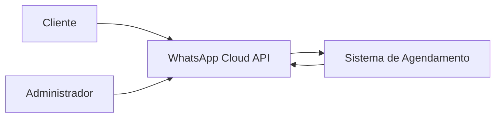

# Especificação do Sistema

## 1. Apresentação

Este documento apresenta a especificação de um sistema de agendamento para uma barbearia via WhatsApp. A solução tem como objetivo automatizar parte do atendimento, permitindo que clientes consultem serviços, escolham profissionais, verifiquem horários disponíveis e realizem agendamentos por meio de uma conversa automatizada.

A especificação reúne os principais atores, requisitos funcionais, requisitos não funcionais, regras de negócio, casos de uso e critérios de aceite, servindo como base para a implementação, validação e evolução do projeto.

## 2. Atores e Sistemas Externos

Os atores representam os usuários e sistemas externos que interagem diretamente com o sistema de agendamento para barbearia via WhatsApp.

| Ator | Tipo | Descrição |
|---|---|---|
| Cliente | Ator principal | Pessoa que utiliza o WhatsApp para consultar serviços, escolher profissional, verificar horários disponíveis, realizar agendamentos, consultar seus agendamentos futuros e cancelar seus próprios agendamentos. |
| Administrador | Ator principal | Responsável pela barbearia, utiliza o WhatsApp para consultar a agenda, bloquear horários, liberar períodos e cancelar agendamentos quando necessário. |
| WhatsApp Cloud API | Sistema externo | Serviço responsável por intermediar a comunicação entre os usuários e o sistema, recebendo mensagens enviadas pelo WhatsApp e permitindo o envio de respostas automáticas. |

### 2.1 Visão de interação dos atores

## 3. Requisitos Funcionais

Os requisitos funcionais descrevem as funcionalidades que o sistema deve oferecer aos usuários e aos serviços externos envolvidos no processo de agendamento.

| Código | Requisito funcional |
|---|---|
| RF01 | O cliente consulta os serviços disponíveis da barbearia. |
| RF02 | O cliente consulta os profissionais disponíveis para atendimento. |
| RF03 | O cliente consulta datas e horários disponíveis para agendamento. |
| RF04 | O cliente realize um agendamento informando serviço, profissional, data, horário e nome. |
| RF05 | O cliente consulta seus próprios agendamentos futuros. |
| RF06 | O cliente cancele somente agendamentos vinculados ao seu próprio telefone. |
| RF07 | O administrador consulta a agenda por data e profissional. |
| RF08 | O administrador bloqueie períodos da agenda. |
| RF09 | O administrador libera períodos anteriormente bloqueados. |
| RF10 | O administrador cancela agendamentos quando necessário. |
| RF11 | O sistema envia confirmação ao cliente após a criação ou cancelamento de um agendamento. |
| RF12 | O sistema deve registrar alterações relevantes no estado dos agendamentos. |

## 4. Requisitos Não Funcionais

Os requisitos não funcionais descrevem as características de qualidade que o sistema deve atender, como segurança, privacidade, confiabilidade, desempenho e facilidade de manutenção.

| Código | Requisito não funcional |
|---|---|
| RNF01 | O sistema deve validar a autenticidade dos eventos recebidos pelo webhook do WhatsApp antes de processar mensagens. |
| RNF02 | O sistema deve proteger dados pessoais dos clientes, como nome, telefone e informações de agendamento. |
| RNF03 | O sistema deve proteger credenciais e chaves de integração por meio de variáveis de ambiente, evitando exposição desses dados no repositório. |
| RNF04 | O sistema deve evitar o processamento duplicado da mesma mensagem recebida pelo WhatsApp. |
| RNF05 | O sistema deve responder rapidamente às requisições recebidas pelo webhook, reduzindo o risco de reenvio de eventos pelo provedor externo. |
| RNF06 | O sistema deve manter as regras de negócio separadas das integrações externas, facilitando manutenção e testes. |
| RNF07 | O sistema deve permitir a validação das principais regras de agendamento por meio de testes automatizados. |
| RNF08 | O sistema deve manter a consistência dos dados de agendamento em situações de tentativas simultâneas de reserva. |
| RNF09 | O sistema deve tratar erros de banco de dados e falhas de comunicação com a API do WhatsApp de forma controlada. |
| RNF10 | O sistema deve utilizar configurações externas para dados sensíveis e informações que possam mudar entre ambientes, como versão da API, credenciais e conexão com o banco de dados. |

## 5. Regras de Negócio

As regras de negócio definem as condições que devem ser respeitadas pelo sistema durante os processos de consulta, agendamento, bloqueio, liberação e cancelamento de horários.

| Código | Regra de negócio |
|---|---|
| RN01 | Um cliente só pode consultar e cancelar agendamentos vinculados ao próprio telefone. |
| RN02 | Apenas agendamentos com estado permitido podem ser cancelados. |
| RN03 | Um profissional não pode possuir atendimentos com horários sobrepostos. |
| RN04 | A disponibilidade deve considerar a duração do serviço, os bloqueios existentes e os agendamentos já cadastrados. |
| RN05 | Não é permitido criar agendamentos em datas ou horários passados. |
| RN06 | Bloqueios administrativos devem possuir data e horário válidos. |
| RN07 | Cada mensagem recebida pelo WhatsApp deve possuir controle para evitar processamento duplicado. |
| RN08 | O acesso administrativo deve ser permitido apenas para o telefone autorizado nas configurações do sistema. |
| RN09 | Os estados do agendamento devem pertencer a um conjunto definido, como `agendado`, `confirmado`, `concluido`, `cancelado` e `ausente`. |
| RN10 | A consulta de agendamentos do cliente deve retornar apenas agendamentos futuros ou ainda válidos. |
| RN11 | O sistema deve impedir a criação de serviços com preço ou duração inválidos. |
| RN12 | O sistema deve impedir duplicidade indevida no cadastro inicial de profissionais e serviços. |

## 6. Casos de Uso

Os casos de uso descrevem as principais interações entre os atores e o sistema, apresentando o objetivo de cada funcionalidade e o fluxo esperado de execução.

### UC01 - Consultar serviços disponíveis

| Campo | Descrição |
|---|---|
| Ator principal | Cliente |
| Objetivo | Consultar os serviços oferecidos pela barbearia. |
| Pré-condição | O cliente iniciou uma conversa com o sistema pelo WhatsApp. |
| Fluxo principal | O cliente solicita a consulta de serviços; o sistema busca os serviços cadastrados; o sistema envia a lista de serviços disponíveis ao cliente. |
| Pós-condição | O cliente visualiza os serviços disponíveis para agendamento. |

### UC02 - Realizar agendamento

| Campo | Descrição |
|---|---|
| Ator principal | Cliente |
| Objetivo | Criar um agendamento para atendimento na barbearia. |
| Pré-condição | Existem serviços, profissionais e horários disponíveis cadastrados no sistema. |
| Fluxo principal | O cliente escolhe a opção de agendamento; o sistema apresenta os serviços; o cliente seleciona um serviço; o sistema apresenta os profissionais; o cliente seleciona um profissional; o sistema apresenta datas e horários disponíveis; o cliente escolhe um horário; o cliente informa seu nome; o sistema valida os dados; o sistema registra o agendamento; o sistema envia a confirmação ao cliente. |
| Fluxo alternativo | Caso o horário escolhido deixe de estar disponível, o sistema informa a indisponibilidade e solicita a escolha de outro horário. |
| Pós-condição | O agendamento fica registrado com estado inicial permitido pelo sistema. |

### UC03 - Consultar próprios agendamentos

| Campo | Descrição |
|---|---|
| Ator principal | Cliente |
| Objetivo | Consultar os agendamentos futuros vinculados ao próprio telefone. |
| Pré-condição | O cliente possui pelo menos um agendamento futuro cadastrado. |
| Fluxo principal | O cliente solicita a consulta de seus agendamentos; o sistema identifica o telefone do cliente; o sistema busca somente agendamentos futuros vinculados ao telefone; o sistema envia a lista ao cliente. |
| Fluxo alternativo | Caso não existam agendamentos futuros, o sistema informa que nenhum horário foi encontrado. |
| Pós-condição | O cliente recebe a relação de seus agendamentos futuros ou a informação de ausência de registros. |

### UC04 - Cancelar próprio agendamento

| Campo | Descrição |
|---|---|
| Ator principal | Cliente |
| Objetivo | Cancelar um agendamento vinculado ao próprio telefone. |
| Pré-condição | O cliente possui um agendamento futuro em estado que permite cancelamento. |
| Fluxo principal | O cliente solicita o cancelamento; o sistema lista os agendamentos futuros do cliente; o cliente seleciona o agendamento desejado; o sistema valida se o agendamento pertence ao telefone do cliente e se o estado permite cancelamento; o sistema atualiza o estado do agendamento; o sistema envia confirmação ao cliente. |
| Fluxo alternativo | Caso o agendamento não pertença ao cliente ou não permita cancelamento, o sistema nega a operação e informa que o cancelamento não pode ser realizado. |
| Pós-condição | O agendamento selecionado é marcado como cancelado quando todas as regras forem atendidas. |

### UC05 - Consultar agenda administrativa

| Campo | Descrição |
|---|---|
| Ator principal | Administrador |
| Objetivo | Consultar os agendamentos da barbearia por data e profissional. |
| Pré-condição | O administrador está utilizando o telefone autorizado nas configurações do sistema. |
| Fluxo principal | O administrador solicita a consulta da agenda; o sistema solicita ou recebe a data e o profissional; o sistema valida os dados informados; o sistema busca os agendamentos correspondentes; o sistema envia a agenda ao administrador. |
| Fluxo alternativo | Caso não existam agendamentos para os filtros informados, o sistema informa que a agenda está vazia. |
| Pós-condição | O administrador visualiza os horários da agenda consultada. |

### UC06 - Bloquear período da agenda

| Campo | Descrição |
|---|---|
| Ator principal | Administrador |
| Objetivo | Bloquear um período para impedir novos agendamentos. |
| Pré-condição | O administrador está utilizando o telefone autorizado e informa data, horário e profissional válidos. |
| Fluxo principal | O administrador solicita o bloqueio de horário; o sistema recebe data, horário e profissional; o sistema valida se o período é válido e não está no passado; o sistema registra o bloqueio; o sistema confirma o bloqueio ao administrador. |
| Fluxo alternativo | Caso o período seja inválido ou conflite com regra definida, o sistema informa que o bloqueio não pode ser realizado. |
| Pós-condição | O período bloqueado deixa de aparecer como disponível para novos agendamentos. |

### UC07 - Liberar período bloqueado

| Campo | Descrição |
|---|---|
| Ator principal | Administrador |
| Objetivo | Liberar um período anteriormente bloqueado. |
| Pré-condição | Existe um período bloqueado cadastrado no sistema. |
| Fluxo principal | O administrador solicita a liberação de um período; o sistema identifica o bloqueio informado; o sistema valida a solicitação; o sistema remove ou altera o estado do bloqueio; o sistema confirma a liberação ao administrador. |
| Fluxo alternativo | Caso o bloqueio informado não exista, o sistema informa que nenhum período correspondente foi encontrado. |
| Pós-condição | O período volta a poder ser considerado na consulta de disponibilidade. |

### UC08 - Cancelar agendamento como administrador

| Campo | Descrição |
|---|---|
| Ator principal | Administrador |
| Objetivo | Cancelar um agendamento da barbearia quando necessário. |
| Pré-condição | O administrador está utilizando o telefone autorizado e o agendamento existe no sistema. |
| Fluxo principal | O administrador solicita o cancelamento de um agendamento; o sistema localiza o agendamento informado; o sistema valida se o estado permite cancelamento; o sistema atualiza o estado do agendamento; o sistema confirma o cancelamento ao administrador. |
| Fluxo alternativo | Caso o agendamento não exista ou não permita cancelamento, o sistema informa que a operação não pode ser realizada. |
| Pós-condição | O agendamento é marcado como cancelado quando a operação for válida. |

## 7. Critérios de Aceite

Os critérios de aceite definem condições objetivas que devem ser atendidas para considerar as funcionalidades do sistema corretas do ponto de vista do usuário e das regras de negócio.

| Código | Critério de aceite |
|---|---|
| CA01 | Dado que existem serviços cadastrados, quando o cliente solicitar a consulta de serviços, então o sistema deve retornar a lista de serviços disponíveis. |
| CA02 | Dado que existem profissionais cadastrados, quando o cliente solicitar a consulta de profissionais, então o sistema deve retornar a lista de profissionais disponíveis para atendimento. |
| CA03 | Dado que o cliente selecionou serviço e profissional, quando solicitar horários disponíveis, então o sistema deve retornar apenas horários livres e válidos. |
| CA04 | Dado que o cliente informou serviço, profissional, data, horário e nome válidos, quando confirmar o agendamento, então o sistema deve registrar o agendamento e enviar mensagem de confirmação. |
| CA05 | Dado que o horário escolhido já está ocupado ou bloqueado, quando o cliente tentar agendar, então o sistema deve impedir o cadastro e informar a indisponibilidade. |
| CA06 | Dado que o cliente possui agendamentos futuros, quando solicitar seus agendamentos, então o sistema deve retornar apenas os registros vinculados ao seu telefone. |
| CA07 | Dado que o cliente solicita cancelamento, quando o agendamento pertence ao seu telefone e possui estado permitido, então o sistema deve cancelar o agendamento e enviar confirmação. |
| CA08 | Dado que o cliente solicita cancelamento de um agendamento que não pertence ao seu telefone, quando a operação for processada, então o sistema deve negar o cancelamento. |
| CA09 | Dado que o administrador consulta a agenda por data e profissional, quando existirem agendamentos correspondentes, então o sistema deve retornar os horários encontrados. |
| CA10 | Dado que o administrador informa data, horário e profissional válidos, quando solicitar bloqueio de período, então o sistema deve registrar o bloqueio e impedir novos agendamentos naquele período. |
| CA11 | Dado que existe um período bloqueado, quando o administrador solicitar sua liberação, então o sistema deve liberar o período para nova consulta de disponibilidade. |
| CA12 | Dado que uma mensagem recebida já foi processada, quando o mesmo evento for recebido novamente, então o sistema não deve executar a mesma operação em duplicidade. |
| CA13 | Dado que dados inválidos forem informados, como data inexistente, horário inválido ou identificador inexistente, quando a solicitação for processada, então o sistema deve rejeitar a entrada e orientar o usuário. |
| CA14 | Dado que ocorra falha no banco de dados ou na comunicação com a API do WhatsApp, quando a operação for executada, então o sistema deve tratar o erro de forma controlada sem expor informações sensíveis ao usuário. |
