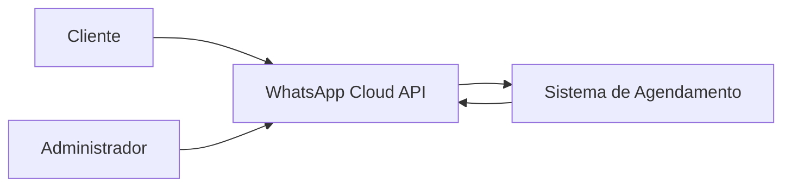

# Especificação do Sistema

## 1. Apresentação

Este documento apresenta a especificação do sistema de agendamento para barbearia via WhatsApp. A solução tem como objetivo automatizar parte do atendimento, permitindo que clientes consultem serviços, escolham profissionais, verifiquem horários disponíveis e realizem agendamentos por meio de uma conversa automatizada.

A especificação reúne os principais atores, requisitos funcionais, requisitos não funcionais, regras de negócio, casos de uso e critérios de aceite, servindo como base para a implementação, validação e evolução do projeto.

## 2. Atores e Sistemas Externos

Os atores representam os usuários e sistemas externos que interagem diretamente com o sistema de agendamento para barbearia via WhatsApp.

| Ator | Tipo | Descrição |
|---|---|---|
| Cliente | Ator principal | Pessoa que utiliza o WhatsApp para consultar serviços, escolher profissional, verificar horários disponíveis, realizar agendamentos, consultar seus agendamentos futuros e cancelar seus próprios agendamentos. |
| Administrador | Ator principal | Responsável pela barbearia, utiliza o WhatsApp para consultar a agenda, bloquear horários, liberar períodos e cancelar agendamentos quando necessário. |
| WhatsApp Cloud API | Sistema externo | Serviço responsável por intermediar a comunicação entre os usuários e o sistema, recebendo mensagens enviadas pelo WhatsApp e permitindo o envio de respostas automáticas. |

### 2.1 Visão de interação dos atores

